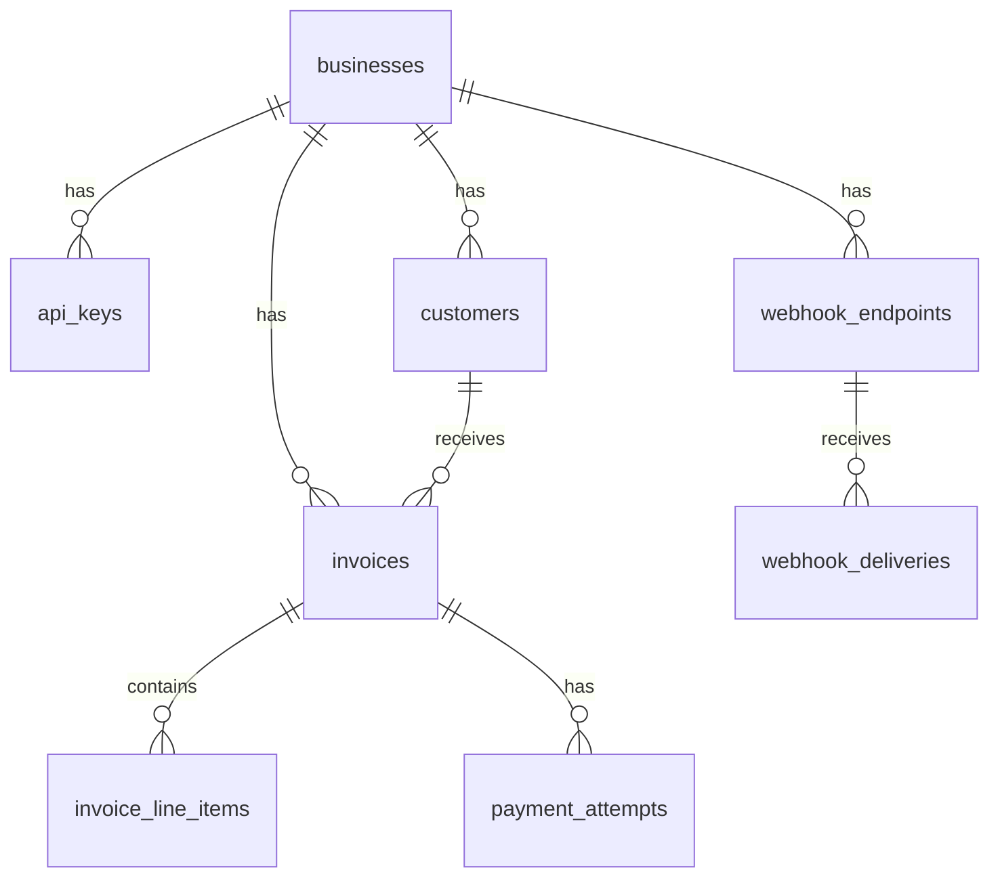
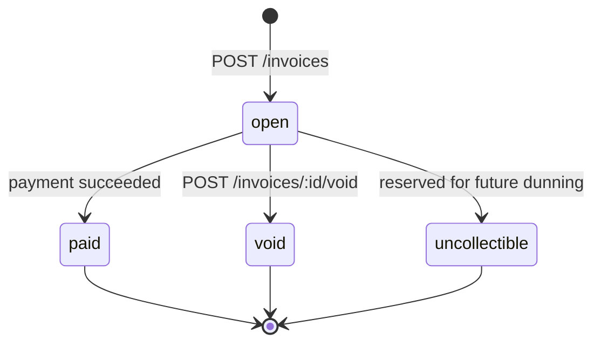

# Design Document — Invoice & Payment Service

## 1. Data Model

| Table | Primary key | Important indexes |
|-------|-------------|-------------------|
| `businesses` | UUID | — |
| `api_keys` | UUID | `(key_prefix)` partial where not revoked |
| `customers` | UUID | `(business_id)` |
| `invoices` | UUID | `(business_id, state)`, `(customer_id)` |
| `invoice_line_items` | UUID | `(invoice_id)` |
| `payment_attempts` | UUID | **UNIQUE `(business_id, idempotency_key)`**, `(invoice_id)` |
| `webhook_endpoints` | UUID | `(business_id)` |
| `webhook_deliveries` | UUID | `(status, next_retry_at)` where pending |

**Why this shape:** Invoices and line items are normalized so totals are computed server-side from immutable line rows. Payment attempts are first-class rows rather than JSON blobs so idempotency keys, PSP references, and retry state are queryable. Webhook deliveries are decoupled from API handlers in their own outbox table.

**At 100× scale:** Partition `webhook_deliveries` and `payment_attempts` by time or business_id, add read replicas for list endpoints, and move webhook delivery to a dedicated queue (SQS/Kafka) with consumer workers.

## 2. Invoice State Machine

| Transition | Trigger | Terminal? |
|------------|---------|-----------|
| → `open` | Invoice created | No |
| `open` → `paid` | PSP success | Yes |
| `open` → `void` | Explicit void API | Yes |
| `open` → `uncollectible` | Not implemented in MVP | Yes |

**Reversible transitions:** None. Terminal states are immutable.

**Invalid transitions:** Rejected with `409 Conflict` and error code `invalid_state_transition`. Examples: paying a `paid` invoice, voiding a `paid` invoice.

The `draft` enum value exists for future use but invoices are created directly in `open` per product choice (immediately payable).

## 3. Payment Correctness & Failure Modes

**Concurrency mechanism:** PostgreSQL row-level lock (`SELECT … FOR UPDATE` on the invoice row) plus an in-flight guard (`processing`/`pending` attempts) plus idempotency keys.

### (a) Two concurrent POST /pay on the same invoice

Both requests serialize on the invoice row lock. The first inserts a `processing` attempt and proceeds. The second sees an in-flight attempt (or a terminal invoice state after the first completes) and returns `409 Conflict`. Outcome: at most one successful charge.

### (b) PSP timeout (`tok_timeout`, 30s)

The API-facing PSP client uses a **5-second timeout**. On timeout the attempt is marked `pending`, invoice stays `open`, and the handler returns **`202 Accepted`**. A background reconciler retries with a **35-second timeout**, completes the charge, and updates invoice state + webhooks. Callers poll `GET /invoices/{id}`.

### (c) PSP success but crash before persist

The idempotency key is stored before calling the PSP. If the handler crashes after PSP success but before persisting the response, the client retries with the same key. The stored attempt row is found and the cached response is replayed — no second PSP call. In production we would also pass idempotency keys to the PSP.

### (d) Idempotency key reused with different body

We hash the request body at payment time. If the same `(business_id, idempotency_key)` exists with a different hash → **`422 Unprocessable Entity`** (`idempotency_key_reused`).

### (e) POST /pay on a paid invoice

Inside the locked transaction the invoice state is checked. `paid` is not payable → **`409 Conflict`**.

**Why row lock over alternatives:** Advisory locks would work but are easier to leak on connection pool churn. Serializable isolation is heavier than needed. Optimistic concurrency alone does not serialize two simultaneous pay attempts cleanly. `FOR UPDATE` is explicit, well-understood, and scoped to one invoice.

## 4. Webhook Design

**Signing:** HMAC-SHA256 over `{unix_timestamp}.{raw_json_body}` using the endpoint signing secret. Headers: `X-Webhook-Signature`, `X-Webhook-Timestamp`, `X-Webhook-Id`.

**Replay protection:** Receivers should reject timestamps older than 5 minutes.

**Retry policy:** 6 attempts at **0s, 30s, 2m, 10m, 1h, 6h** (~7.5 hours total). Failed deliveries after max attempts are marked `dead` and logged.

**Missed events:** Businesses reconcile via `GET /invoices` and periodic full sync; production would add a signed event log API.

**Decoupling:** API handlers insert into `webhook_deliveries` and return. A background worker polls due rows and POSTs to registered URLs — webhook latency never blocks payment responses.

## 5. API Key Model

- **Generation:** `dodo_live_` + 32 random alphanumeric characters.
- **Storage:** SHA-256 hash + 8-character prefix for lookup. Plaintext never stored.
- **Transmission:** `Authorization: Bearer <key>` over HTTPS (TLS assumed in production).
- **Rotation:** Issue new key via admin endpoint (not built); revoke old key by setting `revoked_at`.
- **Revocation:** Soft-delete via `revoked_at`; middleware rejects revoked keys.
- **Blast radius:** A leaked key grants full access to that business's data. Prefix display helps identify which key leaked without exposing the secret.

## 6. What We Cut and Why

1. **Refunds / partial payments** — out of scope; would need credit notes and PSP refund APIs.
2. **Subscriptions / recurring billing** — different product surface entirely.
3. **Multi-currency / tax** — assignment explicitly excluded; keeps money path integer USD cents only.
4. **Rate limiting** — discussed in production gaps; not needed for correctness demo.
5. **Email notifications** — webhooks cover business notification; email is redundant for MVP.

## 7. Production Readiness Gaps

1. **Observability** — no metrics, structured trace IDs, or alerting on dead webhook deliveries.
2. **Rate limiting & abuse protection** — API keys authenticate but do not throttle brute-force or pay spam.
3. **Audit log** — no immutable record of who changed invoice state or revoked keys.
